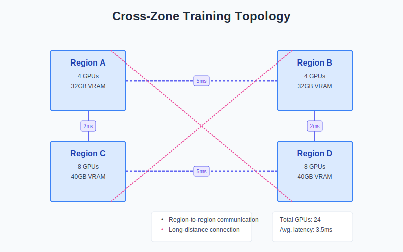
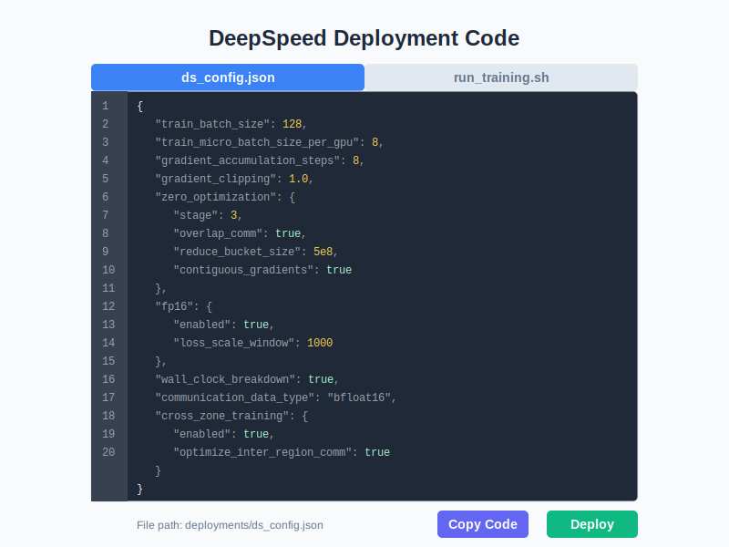

# CrossZoneLLM：跨区域大模型训练优化平台

## 项目介绍
CrossZoneLLM是一个专为跨区域大模型训练设计的优化平台，旨在解决地理分布的GPU集群在训练大型语言模型时面临的通信瓶颈问题。通过智能并行策略推荐、通信优化和可视化分析，帮助研究人员和工程师在跨地域环境中高效训练大型语言模型。

## 功能特性
- **跨区域训练拓扑可视化**：直观展示多区域GPU集群的地理分布和通信连接
- **智能并行策略推荐**：基于模型大小、GPU数量和网络条件，自动推荐最佳数据并行(DP)、流水线并行(PP)和张量并行(TP)组合
- **通信开销分析**：详细分析跨区域训练中的通信量、通信时间和计算时间
- **通信隐藏策略**：基于计算:通信时间比，提供梯度累积、数据压缩、预测通信等优化策略
- **DeepSpeed部署代码生成**：自动生成优化的DeepSpeed配置和启动脚本
- **性能指标可视化**：通过图表直观展示并行策略的各项性能指标

## 项目结构
```
├── index.html          # 主页面
├── styles.css          # 样式文件
├── app.js              # 主要JavaScript逻辑
├── README.md           # 英文说明文档
├── README_zh.md        # 中文说明文档
├── images/             # 图片资源
│   ├── deployment-code.svg  # 部署代码示意图
│   ├── training-map.svg     # 训练地图示意图
│   └── communication-analysis.svg # 通信分析示意图
└── fonts/              # 字体文件
```

## 快速启动

1. **安装依赖**
   
   项目使用纯前端技术实现，无需后端服务即可运行基础功能。只需在浏览器中打开`index.html`文件即可开始使用。
   
   如需使用完整功能（包括部署到DeepSpeed），请确保已安装DeepSpeed和相关依赖。

2. **启动服务**
   
   ```bash
   # 方法1：直接在浏览器中打开index.html
   open index.html
   
   # 方法2：使用Python的HTTP服务器
   python -m http.server
   # 然后在浏览器中访问 http://localhost:8000
   ```

## Web界面概述

### 训练地图 (Training Map)

训练地图页面直观展示了跨区域GPU集群的拓扑结构，包括各区域的GPU数量、区域间的距离和通信连接。通过这个视图，用户可以清晰地了解整个训练集群的物理分布情况，为后续的并行策略选择提供直观参考。



### 并行策略 (Parallel Strategy)

并行策略页面展示了系统推荐的最佳数据并行(DP)、流水线并行(PP)和张量并行(TP)组合。该页面通过雷达图直观对比了推荐策略与其他并行策略（如仅数据并行、仅模型并行）在计算效率、通信开销、内存使用等方面的差异。

### 通信分析 (Communication Analysis)

通信分析页面详细展示了跨区域训练中的各项通信指标，包括：

- **总通信量**：每次迭代的总通信数据量
- **通信时间**：数据传输所需的时间
- **计算时间**：模型计算所需的时间
- **并行效率**：计算时间占总时间的比例
- **通信比例**：通信时间占总时间的比例
- **跨区域通信因子**：区域间距离和数量对通信的影响

此外，该页面还提供了基于计算:通信时间比的策略推荐：

1. **计算受限场景**（计算时间 << 通信时间）：推荐使用多级梯度累积、高效数据压缩和预测通信等策略
2. **平衡场景**（计算时间 ≈ 通信时间）：推荐使用通信与计算重叠、梯度累积和高效数据压缩等策略
3. **通信受限场景**（计算时间 >> 通信时间）：推荐使用通信与计算完全重叠、流水线通信模式和异步通信模式等策略

### 策略切换功能

通信分析页面还提供了实时策略切换功能，用户可以调整以下参数以观察对通信性能的影响：

- 梯度累积（Gradient Accumulation）
- 数据压缩（Data Compression）
- 预测通信（Predictive Communication）
- 异步通信（Async Communication）
- 通信原语（Communication Primitive）
- 通信块大小（Chunk Size）
- 重叠系数（Overlap Coefficient）

### 部署代码 (Deployment Code)

部署代码页面提供了自动生成的DeepSpeed配置文件和启动脚本，包含了针对用户特定配置优化的参数。用户可以直接复制这些代码用于实际的大模型训练部署。



## 使用说明

1. **参数配置**
   - **区域数量**：输入参与训练的区域数量
   - **每区域GPU数量**：输入每个区域的GPU数量
   - **模型大小**：选择训练的模型大小（单位：B，十亿参数）
   - **批量大小**：设置训练的批量大小
   - **网络延迟**：输入区域间的网络延迟（毫秒）
   - **网络带宽**：输入区域间的网络带宽（Gbps）
   - **区域间距离**：配置各区域之间的物理距离（公里）

2. **计算配置**
   - 点击"计算配置"按钮，系统将根据输入参数计算最佳并行策略和通信优化方案
   - 查看"训练地图"、"并行策略"和"通信分析"选项卡中的详细结果
   - 根据需要调整策略切换选项，观察对性能的影响

3. **部署步骤**
   - 查看"部署代码"选项卡中的DeepSpeed配置文件和启动脚本
   - 点击"复制代码"按钮将代码复制到剪贴板
   - 将代码粘贴到您的训练环境中
   - 替换脚本中的`master_node_ip`为您的主节点IP地址
   - 执行脚本开始训练

## 技术栈

- **前端**：HTML5, CSS3, JavaScript, Tailwind CSS, Font Awesome, Chart.js
- **后端**：Python, Flask（可选，用于完整部署功能）
- **分布式训练**：DeepSpeed

## 注意事项

- 在实际部署时，请确保替换脚本中的IP地址和端口号为您的实际集群配置
- 跨区域训练对网络稳定性要求较高，请确保网络连接可靠
- 对于大规模模型，建议使用高性能GPU和高速网络连接以获得最佳性能
- 如需修改区域间距离和网络参数，请在"计算配置"前更新，否则需要重新计算

## 开发说明

如果您想扩展或修改此项目：

- 修改`app.js`文件中的`calculateCommunication`函数以更新通信计算模型
- 修改`styles.css`文件以自定义界面样式
- 在`images`目录中替换或添加新的示意图
- 更新`index.html`中的UI元素以添加新功能

## 许可证

本项目采用MIT许可证 - 详见LICENSE文件